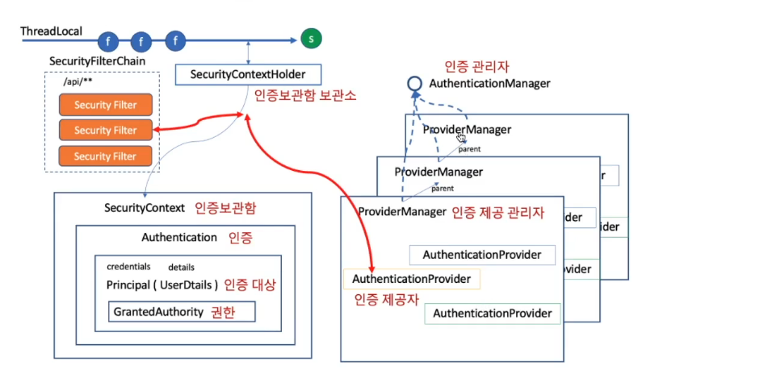
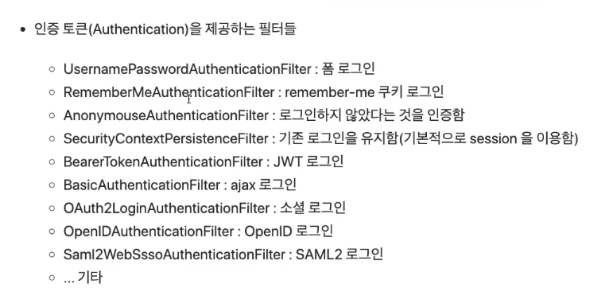

#로그인하기

---
- 스프링 프레임워크에서 로그인을 한다는 것?   
  authenticated가 true!인 Authentication 객체를 SecurityContext가 갖고 있는 상태  
  
쉽게 말해 Authentication객체의 authenticated가 true면 로그인 상태라는 거 아니?  
뒤집어 말하면 저 객체에 로그인 정보를 저장한다는 말이겠네.

단 Authentication이 AnonymouseAuthenticationToken만 아니면 된다.

Authentication(인증)의 기본 구조   
지난 번에 봤던 일부 필터가 이 역할을 해줌

SecurityContextHolder 보관소  
SecurityContext 인증보관함  
Authentication 인증  (쉽게 말하면 통행증임)
이 인증 안에 Principal(UserDetails)와 GrantedAuthority 권한이 들어있다.  

이 Authentication을 제공해주는 건 AuthenticationProvider임. 만들어주겠지?  
AuthenticationManager 인증관리자와 ProviderManager 인증 제공 관리자가 관리함. 뭐 어떻게 구현되어 있겠지?

이런 인증 발급 받으려면? 이걸 인증 받아서 발급해줘야겠지?  
이 인증 토큰을 제공하는 필터들 = 로그인 방법

로그인 하는 방식에 따라서 토큰 발급해줄... 녀석을 골라서 사용할 수 있겠다.
골라주는 건 security가 해주는 거 같고 어떻게 넘길지만 결정하면 되는 것 같기도?

- Authentication은 인터페이스로 아래와 같은 정보들을 갖고 있다.

- Set<GrantedAuthority> authorities : 인증된 권한 정보
- principal : 사용자 정보. UserDetails 객체가 온다.
- credentials : 인증 확인을 위한 정보. 주로 비밀번호가 오는데... 인증 후에는 보안 위해 삭제함
- details : IP, 세션정보, 기타 인증 요청 사용 정보. request정보 (httpServlet가져올 필요 없음)
- boolean authenticated : 인증되었는가?