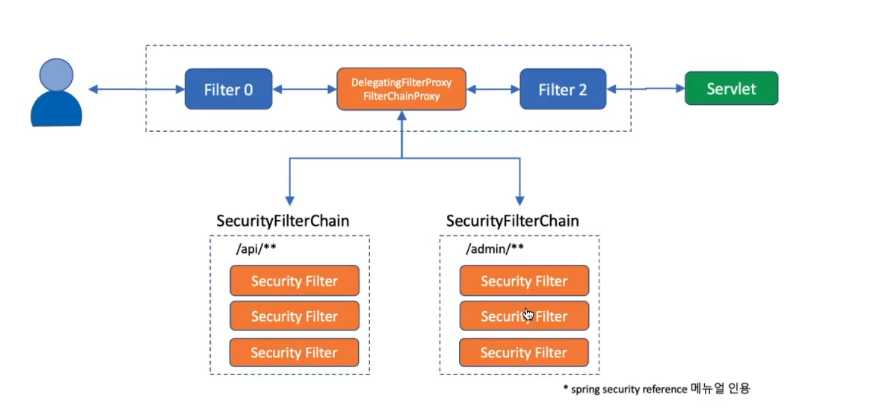
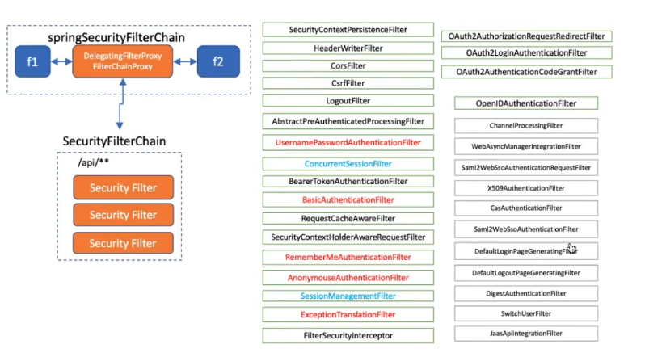

#스프링 시큐리티의 큰 그림

---

###서블릿 컨테이너
톰캣과 같은 웹 애플리케이션을 서블릿 컨테이너라고 부르는데, 이런 웹 애플리케이션은
기본적으로 필터와 서블릿으로 구성되어 있다.

request-> filter1 ->filter2 ->filter 3  
-> DispatchServlet  
에서 Controller를 찾아서 method실행시켜주는 역할을 함.

filter는 session맞춰주거나  
인코딩해주거나 등등.... 이 filter는 체인으로 연결되어 있기 때문에  
DispatchServlet을 가려면 무조건 이 모든 filter를 거쳐야 한다.

###스프링 시큐리티의 큰 그림
스프링 시큐리티는 DelegatingFilterProxy라는 필터를 만들어 메인 필터체인에 끼워넣고,  
그 아래 다시 SecurityFilterChain 그룹을 등록한다.

/api/** 왼쪽 필터 체인을 타고, /admin/** 오른쪽 필터 체인을 타라  

우리가 썼던   
public class SecurityConfig extends WebSecurityConfigurerAdapter  
여기서 WebSecurityConfigurerAdapter   
필터 체인을 구성하는 클래스라고 생각하면 된다.  
config 구성 했던 거 ? 이 필터 안에 내용을 설정하는 것이었음.

이 필터체인에는 다양한 필터들이 들어가는데  
핵심은 여기 필터를 뭘 넣을 수 있는가!를 학습하는 게 포인트 입니다.  

각각의 필터는 대체로 단일 필터, 단일 책임(?) 원칙 처럼, 각기 서로 다른 관심사를 해결한다!
- HeaderWriterFilter : Http 헤더 검사. 써야할 꺼 잘 있는지. 더 해줘야 할 건 없는지?
- CorsFilter : 허가 된 사이트나 클라이언트의 요청인가?
- CsrfFilter : 내가 내보낸 리소스에서 올라온 요청인가?
- LogoutFilter : 로그아웃 하겠다는 건가?
- UsernamePasswordAuthenticationFilter : username /password로 로그인 하려고 하나? 만약 로그인이면 여기서 처리하고 페이지 요청 해줄게
- ConcurrentSessionFilter : 여기저기서 로그인 하는 걸 허용할건가?
- BearerTokenAuthenticationFilter : Authentication 헤더에 Bearer토큰이 오면 인증 처리해줄게
- BasicAuthenticationFilter :  Authentication 헤더에 Basic토큰 오면 인증 처리해줄게
- RequestCacheAwareFilter : 방금 요청한 request 이력이 다음에 필요할 수 있으니, 캐쉬에 담아둘게!
- SecurityContextHolderAwareRequestFilter : 보안 관련
- RememberMeAuthenticationFilter : RememberMe 쿠키를 검사해서 인증 처리해줄게!
- AnonymouseAuthenticationFilter : 인증 안되었으면 너는 Anonymous 사용자구나! AuthenticToken null방지해줌
- SessionManagementFilter : 서버에서 지정한 세선정책으로 검사할게
- ExceptionTranslationFilter : 예외 발생 처리 
- FilterSecurityInterceptor : 여기까지 왔어? 인증이 있다는거지. Authentication 가지고 권한 체크 리턴결과 보내줄게
- 등등 Oauth2와 관련 된 필터 등등등 더 있음. 만들어서 써서 사이 끼워서 쓸 수도 있음

  

